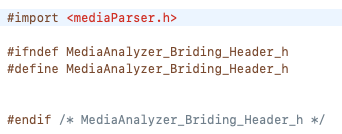

# How to make Universal iOS Static Library and Use

## Making Universal iOS Static Library
1. Make Simple iOS Static Library
<br>
<br>
2. Add Aggregator target to our static library project
   1. Push the '+' button where is left bottom side
<br>
<br>
<br>
<br>
3. Adding New Run Script Phase
<br>
<br>
4. Attached the script to the blank(Reference: Annex A)
<br>
<br>

## Using iOS Static Library in our Project
1. Make Structure <br>
<br>
<br>
2. Set Header Search Path <br>
<br>
<br>
3. Make Briding Header File: [projectName]-briding-Header.h <br>
<br>
<br>
<br>
4. Set Objective-C Briding Header <br>
<br>
<br>

## Annex A - bin/sh code
```
# define output folder environment variable
UNIVERSAL_OUTPUTFOLDER=${BUILD_DIR}/${CONFIGURATION}-universal

xcodebuild -target ${PROJECT_NAME} ONLY_ACTIVE_ARCH=NO -configuration ${CONFIGURATION} -sdk iphoneos  BUILD_DIR="${BUILD_DIR}" BUILD_ROOT="${BUILD_ROOT}"
xcodebuild -target ${PROJECT_NAME} -configuration ${CONFIGURATION} -sdk iphonesimulator -arch x86_64 -arch i386 -arch armv7 -arch armv7s -arch arm64 BUILD_DIR="${BUILD_DIR}" BUILD_ROOT="${BUILD_ROOT}"

mkdir -p "${UNIVERSAL_OUTPUTFOLDER}"
 
lipo -create -output "${UNIVERSAL_OUTPUTFOLDER}/lib${PROJECT_NAME}.a" "${BUILD_DIR}/${CONFIGURATION}-iphoneos/lib${PROJECT_NAME}.a" "${BUILD_DIR}/${CONFIGURATION}-iphonesimulator/lib${PROJECT_NAME}.a"
 
echo "Universal library can be found here:"
echo ${UNIVERSAL_OUTPUTFOLDER}/lib${PROJECT_NAME}.a
 
cp -R "${BUILD_DIR}/${CONFIGURATION}-iphoneos/include" "${UNIVERSAL_OUTPUTFOLDER}/"
```